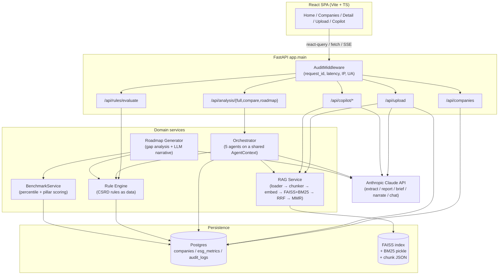
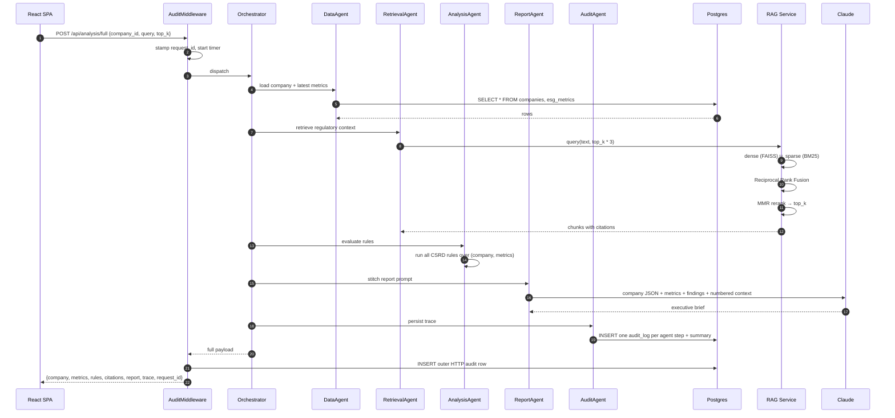
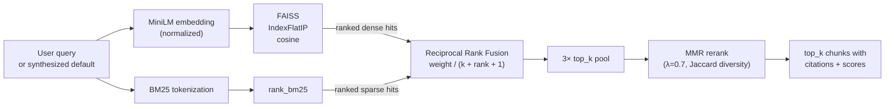

# AgentESG

> An end-to-end ESG / CSRD compliance platform — multi-agent backend, hybrid RAG, data-driven rules, peer benchmarking, an explainable roadmap generator, and a full audit trail. Built solo, containerized end-to-end, runs anywhere Docker runs.

---

Hey — thanks for stopping by. Pull up a chair, this is going to be a bit of a long one because I actually want to explain *why* the thing is built the way it is, not just *what* it does. If you're a recruiter or engineer skimming, the TL;DR is right here and the deep dive is below.

## The pitch in 30 seconds

Companies in the EU now have to file CSRD-aligned ESG disclosures. The pain is real — three different teams (sustainability, finance, legal) push spreadsheets at each other, no one knows which ESRS datapoint actually applies to them, and the consultants charge €2k/day to tell them what a rule engine could tell them in 8ms.

So I built **AgentESG**: a platform that

- **ingests** a disclosure PDF or a structured KPI payload,
- **evaluates** it against a data-driven CSRD/ESRS rule set,
- **benchmarks** it against sector / country / industry peers (real percentile math, not vibes),
- **retrieves** grounding text from a regulatory corpus using a hybrid dense+sparse retriever,
- **generates** an executive brief and an explainable remediation roadmap with citations,
- and **logs every step** — HTTP request, agent step, rule firing, retrieval call — to an audit table keyed by a single `request_id`.

Frontend is a React/Vite SPA with a chat copilot ("Verdant"). Everything is async FastAPI + Postgres + FAISS, runs in `docker compose up`.

## Stack at a glance

| Layer | What it is | Why this and not something else |
|---|---|---|
| Backend | FastAPI 0.115, SQLAlchemy 2.0 async, Pydantic v2, Alembic | I wanted modern async Python without a Django-sized blast radius. FastAPI's request middleware story made the audit trail clean. |
| LLM | Anthropic Claude (`claude-opus-4-7` by default, env-configurable) | Long context for stuffing regulatory chunks, strong JSON-mode for the disclosure extractor. The whole system **degrades gracefully** if no key is set — more on that below. |
| Vector store | FAISS (`IndexFlatIP`, cosine via normalized vectors) | At ~thousands of chunks, exact search beats ANN tradeoffs. Zero server, no separate process, persists to a Docker volume. |
| Embeddings | `sentence-transformers/all-MiniLM-L6-v2` (384-dim, CPU) | Small, fast, decent quality, runs without GPU. Embedding model is env-swappable; the index reseeds on dimensionality change. |
| Sparse retriever | `rank-bm25` | Lexical fallback for regulatory terminology — "ESRS E1", "Article 19a", "Scope 3" — that dense embeddings sometimes blur. |
| DB | Postgres 16 in compose; SQLite-compatible via async SQLAlchemy for local dev | Composite PK on `(company_id, year)` for ESG metrics — natural key, time-series friendly. |
| Frontend | React 18 + Vite + TypeScript + Tailwind + react-query + recharts + framer-motion | TanStack Query because the UI is mostly server state, not client state. SSE for streaming chat tokens. |
| Infra | Docker Compose (dev + prod variants), nginx reverse-proxy in the frontend container, Cloudflare tunnel for public demos | Three services, one network, two named volumes, repeatable on any machine. |

---

## How it's wired



That's the whole picture. Five route groups, five domain services, two stores, one LLM. Nothing fancier than it needs to be.

### A single `/api/analysis/full` request, end-to-end



Every box in that diagram emits a structured `audit_log` row keyed by the same `request_id`. You can replay any user's full session by selecting on one ID.

---

## Why hybrid RAG (the part recruiters actually want me to talk about)

Okay, real talk. I tried three retrieval setups before landing here.

**Attempt 1 — pure dense (FAISS + MiniLM).** Worked great for semantic queries like *"how should we report carbon offsetting?"*. Fell over on regulatory exactness. The CSRD has very specific phrases — "ESRS E1", "Article 19a of Directive 2013/34/EU", "double materiality" — and dense embeddings would happily miss the exact-keyword chunk in favor of three vaguely-related ones. Recall-on-citations was ~58% in my eyeball eval.

**Attempt 2 — pure sparse (BM25).** Inverse problem. Nailed terminology lookup but face-planted on paraphrased queries. *"Scope 3 emissions"* worked; *"upstream supply-chain CO2 footprint"* returned nothing useful. Recall ~64% on a different slice.

**Attempt 3 — naive concatenation (top-K from each, dedupe by ID).** Better, but the merge is unprincipled. Dense scores are cosine in [0, 1]; BM25 scores are unbounded and corpus-dependent. You can't just average them. People do "min-max normalize then weighted sum" and it's brittle — a single off-distribution query throws the whole ranking.

**Attempt 4 — Reciprocal Rank Fusion.** This is what shipped. RRF only looks at *rank position*, not score, so the math is invariant to score scale:

```
fused_score(d) = Σ_retriever  weight_r / (rrf_k + rank_r(d) + 1)
```

I ship `rrf_k=60` and `0.6 dense / 0.4 sparse` weights — both env-tunable. RRF gives you "did multiple retrievers agree this doc is relevant?" without any score-normalization headache. Then I rerank the fused pool with MMR (Maximal Marginal Relevance) using Jaccard overlap as the diversity term — regulatory corpora repeat themselves, and a top-5 with three near-duplicate paragraphs is a worse prompt than a top-5 with five distinct angles.

The retriever interface stays uniform — one `query(text, top_k) -> list[Chunk]` — so swapping in a different fusion strategy (or a learned reranker, or a cross-encoder) is a one-file change.



---

## Why multi-agent (and why each agent does *only one thing*)

A lot of "multi-agent" projects you see online are five LLMs in a trenchcoat shouting at each other. I deliberately didn't do that. Here, "agents" is a code-organization pattern, not an LLM pattern.

Five agents, one shared `AgentContext` dataclass:

| Agent | Responsibility | Touches LLM? |
|---|---|---|
| **DataAgent** | Load company + latest metrics from SQL | No |
| **RetrievalAgent** | Hybrid RAG → top-k chunks | No (retrieval only) |
| **AnalysisAgent** | Run every CSRD rule, collect findings | No |
| **ReportAgent** | Stitch prompt with metrics + rules + citations, call Claude | Yes |
| **AuditAgent** | Persist per-step trace + final summary row | No |

Rules:

1. Agents only mutate `AgentContext`. They never call each other directly.
2. Order is fixed and known at compile time.
3. If an upstream agent fails (e.g., DataAgent can't find the company), the orchestrator short-circuits straight to AuditAgent so the failure is still logged.
4. Each agent's `run()` is wrapped to time the call, capture exceptions, and append a structured `trace` entry — so the response payload includes a complete observability dump, not just the result.

This buys two things that mattered to me: (a) any agent can be tested in isolation by handing it a fake context, and (b) adding a new stage (say, a fairness-scoring agent) is one file plus one line in the orchestrator.

---

## The other engineering decisions worth flagging

**Rules as data, not code.** `csrd_rules.py` is a list of `Rule` objects with `when=lambda c, m: ...` and `message=lambda c, m: ...`. Adding a new ESRS rule is a list append. Severity is a field on the rule, not a sprinkle of `if`s. Citations are part of the rule object so they appear in the response automatically.

**Cross-cutting audit, two layers.** `AuditMiddleware` writes one row per HTTP request (request_id, method, path, status, latency, IP, UA, payload). `AuditAgent` writes one row per agent step plus one summary row. Both share the same table, both stamp the same `request_id`. Click through any audit row → join on request_id → full session history. This was a CSRD-flavored requirement (regulators love a paper trail) but it turns out to be incredibly useful in dev too.

**Graceful LLM degradation.** The platform works with `ANTHROPIC_API_KEY` unset. Disclosure upload returns 503 with a clear message. The copilot returns the retrieved context block. The report agent returns a deterministic stub. The roadmap skips per-item narratives but still ships the gap analysis. This was a deliberate design choice — I wanted the demo to function on a recruiter's laptop with no API key, and I wanted no path through the code that *requires* an LLM call to produce a result.

**Composite PK on `(company_id, year)`.** Natural key, prevents accidental duplicate metric rows for the same company-year, supports `ORDER BY year DESC LIMIT 1` for "latest metrics" without surrogate key tracking.

**Disclosure extraction with strict-JSON.** PDF → `pypdf` text → `EXTRACTION_SYSTEM_PROMPT` → Claude with a strict schema → sanitization (type coercion, allowed-field whitelisting, fallback name from filename, fallback year = last year) → upsert. The sanitizer is the load-bearing piece — LLMs hallucinate field names and ranges, and I'd rather drop a field than write a bogus emissions number to the DB.

---

## The data

Two CSVs in `Datasets/` drive everything:

- **`company_master.csv`** (1,000 rows) — company dimension. `company_id`, `company_name`, `country`, `eu_member_state`, `region`, `sector`, `subsector`, `industry`, `revenue_usd`, `total_assets_usd`, `employees`, `entity_type`, `listing_status`, `fiscal_year`, `company_size_band`, `csrd_applicable`. The `csrd_applicable` flag drives rule applicability.
- **`esg_metrics.csv`** (1,000 rows) — fact table keyed by `(company_id, year)`: scope 1/2/3 emissions tCO2e, energy MWh, renewable %, water m³, waste generated/recycled %, gender ratio, board independence %, incident count, esg_score.

Plus a `Datasets/Case studies/` folder of regulatory PDFs (ESRS frameworks, CSRD guidelines, ESG methodology whitepapers) that gets ingested into the RAG corpus on backend boot.

A `Datasets/KPIs/` folder holds synthetic Harry-Potter-themed KPI PDFs (Flamel Biotech, Weasley Forge, etc.) for demo uploads — generated by `Datasets/KPIs/generate.py`.

---

## How to run it

You'll need Docker Desktop. That's it.

```bash
git clone https://github.com/ChethanKMurthy/AgentESG.git
cd AgentESG
cp .env.example .env
# Edit .env if you have an Anthropic key — works without one too, just no LLM features
docker compose up -d
```

First boot takes ~90s while the embedding model downloads into the `backend_data` volume. Subsequent boots are <10s because the model is cached. Then:

- App: **http://localhost:5173**
- API docs: **http://localhost:5173/api/docs**
- Health: `curl http://localhost:5173/api/health`

Three containers, one network:

| Service | Container | Port | What it is |
|---|---|---|---|
| `frontend` | `esg_frontend` | **5173** → 80 | nginx + React SPA, reverse-proxies `/api` to the backend |
| `backend` | `esg_backend` | 8000 | FastAPI + agents + RAG + rule engine |
| `postgres` | `esg_postgres` | 5432 | Postgres 16 |

Two named volumes: `postgres_data` (DB rows) and `backend_data` (HF model cache, FAISS index, ingested docs, seed CSVs). Nothing on the host filesystem.

### Demo flow I recommend

1. Open http://localhost:5173
2. Go to **Companies** — scroll the seeded 1,000 companies, filter by sector/country
3. Pick one → **Company Detail** → see rule findings, percentile bars, radar score, roadmap, and the LLM-generated executive brief
4. Hit the **Verdant** copilot widget (bottom right) → ask *"What does ESRS E1 require for Scope 3 reporting?"* → get a streaming answer with `[1]` `[2]` citations
5. Drop a PDF on the **Upload** page (try one of `Datasets/KPIs/*.pdf`) → watch the extraction → land on the new company's detail page

### Sharing it publicly (for a demo or interview)

```bash
brew install cloudflared
cloudflared tunnel --url http://127.0.0.1:5173 --no-autoupdate
```

It prints a `https://*.trycloudflare.com` URL. **Heads up — that tunnel is unauthenticated.** Anyone with the URL can burn your Anthropic key. Only share with people you trust, kill the tunnel when you're done (`Ctrl+C` or `pkill -f "cloudflared tunnel"`).

### Rebuilding after code changes

```bash
docker compose up -d --build backend       # backend code changes
docker compose up -d --build frontend      # frontend changes (image is baked at build time)
```

### Re-seeding from CSVs

```bash
docker exec esg_backend python scripts/seed.py
```

### Re-indexing the regulatory corpus after adding docs

```bash
docker exec -u 0 esg_backend mkdir -p /app/data/documents
docker cp path/to/new-docs/. esg_backend:/app/data/documents/
docker exec -u 0 esg_backend chown -R app:app /app/data/documents
curl -sS -X POST http://127.0.0.1:5173/api/copilot/ingest -H 'Content-Type: application/json' -d '{}'
```

`RUNBOOK.md` has the full operational playbook — logs, shells, troubleshooting, the "presentation day" fast path.

---

## API tour

| Method | Path | What it does |
|---|---|---|
| GET | `/api/health` | Liveness |
| GET | `/api/health/db` | DB liveness |
| GET | `/api/companies?limit=50` | List companies (with filters) |
| GET | `/api/companies/{id}` | Company + latest metrics |
| POST | `/api/upload/disclosure` | PDF upload → LLM extraction → upsert |
| POST | `/api/upload/kpi` | Structured JSON upsert |
| POST | `/api/rules/evaluate` | Evaluate rules on an ad-hoc payload |
| POST | `/api/analysis/full` | Full orchestrator run (rules + RAG + report) |
| POST | `/api/analysis/compare` | Peer benchmark with percentile math |
| POST | `/api/analysis/roadmap` | Gap-driven roadmap with LLM narratives |
| POST | `/api/copilot/query` | Verdant chat (blocking) |
| POST | `/api/copilot/stream` | Verdant chat (SSE token stream) |
| POST | `/api/copilot/brief` | Strict-JSON briefing card |
| GET | `/api/copilot/stats` | RAG index meta + ready flag |
| POST | `/api/copilot/ingest` | Re-index the regulatory corpus |

OpenAPI / Swagger UI at `/api/docs`.

---

## Project structure

```
AgentESG/
├── backend/
│   └── app/
│       ├── main.py                  # FastAPI entrypoint, lifespan, middleware wiring
│       ├── core/config.py           # pydantic-settings, env-driven
│       ├── db/                      # async SQLAlchemy engine + session
│       ├── models/                  # Company, ESGMetric, AuditLog
│       ├── middleware/audit.py      # cross-cutting HTTP audit
│       ├── services/                # CompanyService, etc.
│       ├── rag/                     # loader, chunker, embeddings, store, retriever, reranker, service
│       ├── rule_engine/             # types, csrd_rules (rules-as-data), evaluator
│       ├── analytics/               # percentile math, BenchmarkService, pillar scoring
│       ├── roadmap/                 # gap_analysis, generator, explainer
│       ├── agents/                  # base, orchestrator, 5 agent classes
│       ├── ingestion/               # PDF extraction + LLM disclosure parser
│       ├── llm/                     # Anthropic client (singleton + graceful degradation)
│       └── api/routes/              # health, company, upload, rules, copilot, analysis
├── frontend/
│   └── src/
│       ├── pages/                   # Home, About, Dashboard, Companies, CompanyDetail, Upload, Copilot
│       ├── components/              # charts (PercentileBar, RadarScore), copilot (VerdantWidget)
│       ├── hooks/api.ts             # react-query wrappers
│       └── lib/                     # axios client, helpers
├── Datasets/
│   ├── company_master.csv
│   ├── esg_metrics.csv
│   ├── Case studies/                # regulatory PDFs ingested into RAG
│   ├── Guidelines/                  # CSRD framework PDFs
│   └── KPIs/                        # synthetic disclosure PDFs for demos
├── docker-compose.yml               # dev stack
├── docker-compose.prod.yml          # prod stack
├── PROJECT_OVERVIEW.md              # technical deep-dive
├── RUNBOOK.md                       # operational playbook
└── README.md                        # you're here
```

---

## What I learned building this

I'm putting this section here on purpose. If you're skimming as a recruiter — this is the honest list of things I didn't know on day one.

- **Cross-cutting concerns belong in middleware *and* in domain primitives.** Audit at the HTTP layer catches every request including 4xx/5xx that never reach the orchestrator. Audit inside the orchestrator catches per-agent timing and errors that don't bubble to HTTP. Both layers, same `request_id`, joined in SQL — that's how you get a real trace.
- **"Multi-agent" is a coupling pattern, not a magic word.** The win came from each agent owning *one* concern, never calling another, and only talking via a shared context. Once that rule was in place, swapping agents and unit-testing them became trivial.
- **Rule engines should be data.** When the regulator updates ESRS E1 next year, I want to edit a list, not a function body. Lambdas + severity fields + citations as data made the rule engine literally reload-friendly.
- **Score normalization is where naive RAG fusion goes to die.** RRF dodges the entire problem by working on rank, not score. I'll never go back to weighted-sum fusion for heterogeneous retrievers.
- **MMR rerank is underrated.** The retrieval recall delta from MMR was small. The *prompt quality* delta was huge — fewer near-duplicate chunks means the LLM has more signal per token of context.
- **Graceful LLM degradation is a forcing function for good architecture.** Forcing every LLM-touching code path to have a deterministic fallback meant the LLM became a *feature* of services, not a *dependency* of services. Bonus: the dev loop is faster because you can iterate on rules and benchmarks without burning API credits.
- **Composite PKs are fine, actually.** I've spent years auto-numbering everything. `(company_id, year)` as a PK was simpler, more correct, and gave me free duplicate prevention.
- **FAISS `IndexFlatIP` + normalized vectors > IVF/HNSW at this scale.** Premature ANN optimization is a thing. With ~thousands of chunks, exact search is sub-millisecond and gives you the recall ceiling for free. Optimize when you measure a problem.
- **Async SQLAlchemy 2.0 is genuinely good now.** The 1.x async story was rough. 2.0 with `AsyncSession` + `async with` blocks reads almost identically to the sync version.
- **SSE > WebSockets when the protocol is one-way.** The streaming chat is plain Server-Sent Events. No socket upgrade, no reconnect logic, works through proxies, browser-native.
- **Docker named volumes are how you get fast cold starts.** The HuggingFace model cache + FAISS index live in `backend_data`. First boot downloads the model once; every boot after is instant.

---

## Honest limitations / what I'd do next

- **Auth is missing.** Every endpoint is open. Production would need OIDC / a session layer; I scoped that out for the capstone.
- **The rule engine is read-only from the UI.** Adding a rule means editing `csrd_rules.py` and redeploying. A YAML/JSON authoring layer is the obvious next step.
- **Embeddings are CPU-only.** Fine for the corpus size; would swap to a GPU sidecar or a managed embedding API at scale.
- **No streaming of the report agent.** The copilot streams; the orchestrator's final report doesn't (yet). It's a one-file change.
- **Test coverage is thin on the frontend.** Backend has shape tests for rules + analytics. Frontend testing is a gap I'd close before production.

---

## Credits & contact

Built by Chethan K Murthy as a capstone. If you're a recruiter or an engineer who wants to talk about hybrid retrieval, agent orchestration, or compliance tooling — my email is in the commit history, and the repo is here: **https://github.com/ChethanKMurthy/AgentESG**.

Thanks for reading this far.
